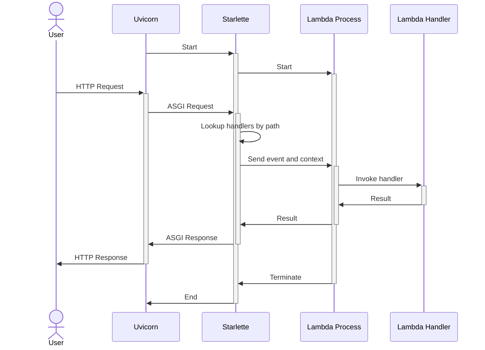

# Smyth

A versatile tool that enhances your AWS Lambda development experience.

## Rationale

Despite extensive testing, nothing matched the efficiency we experienced when developing ASGI (e.g., FastAPI) applications. Below is an overview of the alternatives we evaluated:

- **Serverless (with the serverless-offline plugin)**: This seemed promising, deploying a Node.js server to invoke the lambda in a subprocess, effectively simulating the AWS Lambda runtime through an AWS API Gateway V2 proxy. However, its maintenance is lacking; for instance, a pending pull request to add Python 3.12 as a supported runtime has been unresolved for nearly three months. Additionally, the development experience is hindered by the absence of Python Debugger support.

- **Localstack**: While Localstack offers useful features, its lambda functionality is less satisfactory. Testing code requires building and "uploading" the lambda to Localstack for invocation, a process that takes about a minute—far too slow for efficient local development.

- **AWS SAM**: Although newer and of higher quality than Serverless, AWS SAM offers fewer plugins and only supports pip for dependency management. While faster than Localstack, it still necessitates building the lambda for invocation.

- **Running the code locally**: We also explored using pytest to directly invoke lambda handlers. This approach is viable, but our specific needs require exposing lambdas over HTTP to interact with a remote (or local) instance of Saleor.

- **CDK**: a tool or framework that allows one to define the Lambda stack in Python, it can spin up local Lambda invocations quickly and with many different events. The lacking feature is the HTTP exposure of the Lambda, which is critical when working with Saleor Apps.

- **Flask**: Flask could be used to invoke a handler from an endpoint, we've tried that. After a while of trying to make it work from a single entrypoint (i.e. one Docker container) we ended up with... well this, just that we are using a modern ASGI framework with Uvicorn as the HTTP server.

## Features

- **Pure Python**: The tool is entirely written in Python, offering the flexibility to tailor it to your specific requirements.
- **Customizability**: You have the ability to modify both the `event` and `context` data structures to suit your needs.
- **State Persistence**: Simulating both cold and warm starts, Lambda Processes retain their state across invocations, mimicking the behavior of actual AWS Lambdas. The state is reset only when code changes trigger Uvicorn to reload.
- **Efficiency**: The tool is streamlined and efficient, relying solely on Python to execute the code.
- **Inspired by Serverless Framework**: Its design takes cues from the Serverless framework, known for its effectiveness in managing serverless applications.
- **Developer-Friendly**: Tailored for Python web developers, it integrates seamlessly with common development tools and practices, such as PDB, iPDB, VSCode debugging, and .env file support, ensuring a familiar and productive environment.

## How Smyth Works

Understanding the components involved in the Smyth environment is crucial for effective development. Here's a breakdown of the key terms:

- **Uvicorn**: This is an ASGI server responsible for translating incoming HTTP requests into Python callable formats that ASGI applications can understand. It serves as the interface between the web and your application, enabling asynchronous web server capabilities for Python.

- **Starlette**: A lightweight ASGI framework designed to catch and handle incoming requests. In the context of the Smyth, Starlette facilitates communication with Lambda Processes, effectively acting as a bridge that routes requests to the appropriate handlers.

- **Lambda Process**: This refers to a dedicated Python process that runs a specific Lambda Handler. The primary purpose of maintaining separate processes for each Lambda Handler is to simulate the "warm" state of AWS Lambda functions, allowing them to retain their state between invocations. This setup mirrors the behavior of AWS Lambda in a local development environment.

- **Lambda Handler**: The core component of your Lambda function, written as part of your project. This is the code you craft to respond to Lambda invocations, typically defined as a Python function that accepts an `event` dictionary and a `context` object. The `event` contains information about the invocation, such as the triggering event or data passed to the function, while the `context` provides runtime information about the invocation, the function, and the execution environment.

Smyth operates similarly to Serverless (offline) but is implemented in pure Python with minimal dependencies. It utilizes a Starlette endpoint to provide a catch-all route. Uvicorn, in reload mode, runs Starlette, which automatically restarts the server and refreshes all Lambda processes. At startup, Starlette reads a TOML configuration file, initializing a process for each defined lambda handler. These processes import the handlers and start listening on a `multiprocessing.Queue`. When a request is received, Starlette's endpoint converts it into a Lambda event and places it in the queue. The subprocess then picks it up, invokes the handler, and returns the result to the main process via the queue, which then converts it back into an HTTP response.



## Installation

It's recommended to install this tool in your Lambda project virtual environment with pip, due to its rapid development phase and absence from PyPi. Ensure your `GH_TOKEN` is configured if necessary:

```sh
pip install git+https://github.com/mirumee/smyth@main
```

Or git submodule it into your project and install with `poetry -G dev -e ../libs/smyth`.

## Configuration

### TOML
Define the following settings in your Lambda project's `pyproject.toml` file:

```toml
[tool.smyth]
host = "0.0.0.0"
port = 8080

[tool.smyth.handlers.saleor_handler]
handler_path = "marina_adyen.handlers.saleor.handler.saleor_http_handler"
url_path = "/saleor/{path:path}"
```

### CLI

TOML configuration can be overloaded with `--host` and `--port`. You can also use the `--only` flag to specifically pick handlers defined in the TOML. This is useful if you'd like to run your separate handlers in separate Docker containers (to for example limit their CPU and MEM).

```
python -m smyth run --help
Usage: python -m smyth run [OPTIONS]

Options:
  -h, --host TEXT     Bind socket to this host.
  -p, --port INTEGER  Bind socket to this port.
  --only TEXT         Run only the handler of this name. [list]
  --log-level TEXT    Log level.
  --help              Show this message and exit.
```

Run the server with:

```
python -m smyth run
```

### `tool.smyth` Section

| Key       | Default   | Description                                                                                                    |
|-----------|-----------|----------------------------------------------------------------------------------------------------------------|
| host      | `"0.0.0.0"` | `str` The host address for the Uvicorn server to bind to.                                                      |
| port      | `8080`      | `int` The port for the Uvicorn server to bind to. If set to 0, an available port will be chosen automatically. |
| log_level | `"INFO"`    | `str` The log level for the main ASGI server process.                                                          |

### `tool.smyth.handlers.{handler_name}` Section

| Key                         | Default                                                  | Description                                                                                                                                                                          |
|-----------------------------|----------------------------------------------------------|--------------------------------------------------------------------------------------------------------------------------------------------------------------------------------------|
| **handler_path**            | (Required)                                               | `str` The Python path to the Lambda handler to be invoked.                                                                                                                           |
| **url_path**                | (Required)                                               | `str` The Starlette-like URL path for routing requests to the Lambda handler.                                                                                                        |
| timeout                     | `None`                                                   | `float \| None` The maximum duration (in seconds) before the Lambda times out.                                                                                                       |
| event_data_generator_path   | `"smyth.event.generate_event_data"`                      | `str` Python path to a custom Lambda event data generator.                                                                                                                       |
| context_data_generator_path | `"smyth.context.generate_context_data"`                  | `str` Python path to a custom Lambda context data generator.                                                                                                                     |
| fake_coldstart_time         | `false`                                                  | `bool` If set to true first start will mock the warmup time (0.5 to 1.0 second) - this does nothing but keeps one's brain from forgetting how this lambda will behave in production. |
| log_level                   | `"INFO"`                                                 | `str` The log level for the LambdaProcesses.                                                                                                                                         |
| concurrency                 | `1`                                                      | `int` Number of processes the dispatcher is allowed to spawn                                                                                                                         |
| dispatch_strategy_path      | `"smyth.dispatcher.strategy.RoundRobinDispatchStrategy"` | `str` Python path to a DispatchStrategy class                                                                                                                                                                     |

### Dispatch Strategies

Smyth offers two dispatch strategies to manage how requests are handled by Lambda Processes:

- **Round Robin (`smyth.dispatcher.strategy.RoundRobinDispatchStrategy`)**: This strategy, not typical for AWS Lambda's behavior, is beneficial during development. It rotates among Lambda Processes for each request, given that concurrency is set higher than `1`. This approach encourages developers to avoid relying on global state across requests, promoting best practices in serverless application design.

- **First Warm (`smyth.dispatcher.strategy.FirstWarmDispatchStrategy`)**: This strategy prioritizes the use of the first available Lambda Process in a "warm" state to handle incoming requests. If no warm instances are available, it initiates a "cold start". This behavior more closely mimics the operational dynamics of AWS Lambda, where reusing warm instances can lead to faster response times.

It's important to note that Smyth is intended for local development and not for production use or load testing. The dispatcher and Lambda Process instances are not designed to handle high volumes of concurrent requests and will likely falter under heavy load. This limitation is deliberate, reflecting the tool's focus on local development scenarios where high concurrency is uncommon.

## Customizing Event and Lambda Context Data

Customization of Lambda event and context data allows developers to tailor the runtime environment to their specific needs, enhancing the local development experience. For event data customization:

```python
from smyth.event import generate_event_data

async def generate_custom_event_data(request: Request):
    original_event = await generate_event_data(request)
    original_event["my_custom_data"] = "data"
    return original_event
```

This example demonstrates how to modify the default event payload generation process to include custom data. Developers can leverage the [AWS Serverless Application Model CLI (SAM)](https://docs.aws.amazon.com/serverless-application-model/latest/developerguide/install-sam-cli.html) to generate accurate [example payloads](https://docs.aws.amazon.com/serverless-application-model/latest/developerguide/sam-cli-command-reference-sam-local-generate-event.html) for different AWS services, aiding in the creation of realistic local testing scenarios.

For context data customization, the configuration allows specifying a coroutine that takes additional arguments such as `process_def: ProcessDefinition` and `process: LambdaProcess`. The output from this coroutine is used to create a customized `smyth.dispatcher.runner.FakeLambdaContext`, which can include information about the Smyth runtime environment. This capability is crucial for simulating the full spectrum of AWS Lambda execution contexts, facilitating a more comprehensive and realistic development experience.

## Status endpoint

There is a `GET /__/status` endpoint available on the Starlette server, it will present runtime data about the Lambda processes and used configuration.

## Working with Docker

Assuming you have this already installed by Poetry you can use the `Dockerfile.example` and `docker-compose.example.yml` files from this repository to get started.

## Working with VS Code

To utilize the VS Code debugger with the Smyth tool, you can set up your `launch.json` configuration file as follows. This setup will enable you to debug your Lambda functions directly within VS Code, providing a seamless development experience.

```json
{
    "version": "0.2.0",
    "configurations": [
        {
            "name": "Python Debugger: Module",
            "type": "debugpy",
            "request": "launch",
            "module": "smyth",
            "args": ["run"],
        }
    ]
}
```

## Caveats

The combination of Uvicorn reload process and HTTP server process with what is being done with the Lambda processes is tricky. If a Lambda process is doing something and the HTTP server is killed in the wrong moment it's likely going to bork your terminal. This is not solved yet. It's best to use in a Docker container or have the ability to `kill -9 {PID of the Uvicorn reload process}` at hand.

## TODO

- [ ] Write tests
- [ ] Properly handle Uvicorn exit, kill the LambdaProcesses gracefully
- [ ] Publish on PyPi

## Name

This name blends "Smith" (as in a blacksmith, someone who works in a forge) with "Py" for Python, altering the spelling to "Smyth". Blacksmiths are craftsmen who work with metal in a forge, shaping it into desired forms. Similarly, "Smyth" suggests a tool that helps developers craft and shape their serverless projects with the precision and skill of a smith, but in the realm of Python programming. This name retains the essence of craftsmanship and transformation inherent in a forge while being associated with Python.

# Crafted with ❤️ by Mirumee Software hello@mirumee.com
