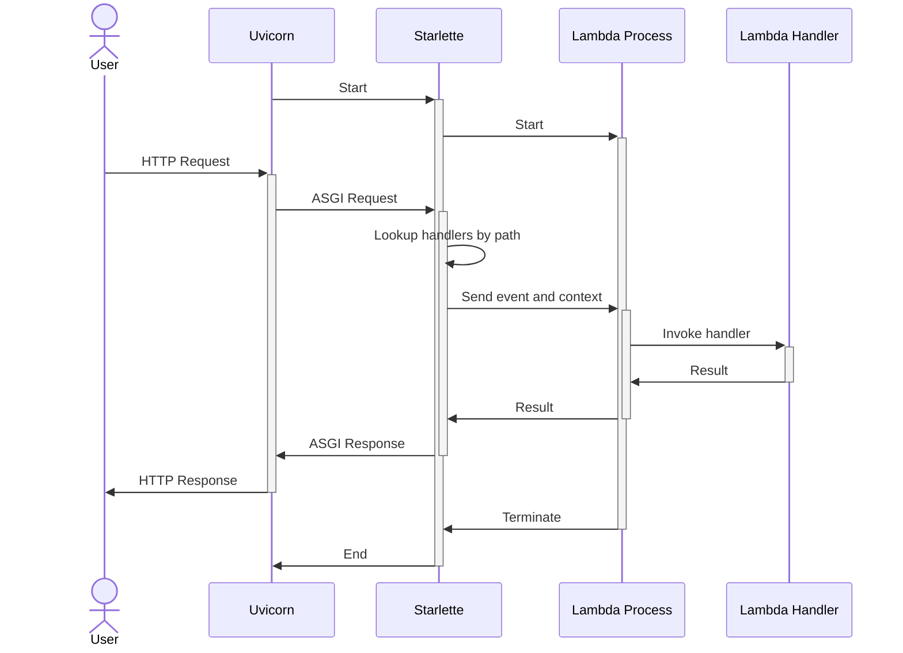

# Smyth

A versatile tool that enhances your AWS Lambda development experience.

## Installation

It's recommended to install Smyth into your project as a development dependency to use the same Python interpreter as your project:

=== "Poetry"
    ```bash
    poetry add --group dev smyth
    ```

=== "pip"
    ```bash
    pip install smyth
    ```

Define the following settings in your Lambda project's `pyproject.toml` file:

```toml
[tool.smyth]
host = "0.0.0.0"
port = 8080

[tool.smyth.handlers.saleor_handler]
handler_path = "my_project.handlers.saleor.handler.saleor_http_handler"
url_path = "/saleor/{path:path}"
```

!!! tip "See [configuration](user_guide/all_settings.md) for more settings and features."

Run Smyth with:

```bash
python -m smyth
```

!!! note "Also see"
    Make sure to check out the [links below](#others-from-mirumee) for more serverless-oriented tools.

## Features

- **Pure Python**: The tool is entirely written in Python, offering flexibility to tailor it to your specific requirements.
- **Customizability**: Modify both the `event` and `context` data structures to suit your needs.
- **State Persistence**: Simulates both cold and warm starts. Lambda processes retain their state across invocations, mimicking the behavior of actual AWS Lambdas. The state is reset only when code changes trigger Uvicorn to reload.
- **Efficiency**: Streamlined and efficient, relying solely on Python to execute the code.
- **Inspired by Serverless Framework**: Takes cues from the Serverless framework, known for its effectiveness in managing serverless applications.
- **Developer-Friendly**: Tailored for Python web developers, it integrates seamlessly with common development tools and practices such as PDB, iPDB, VSCode debugging, and .env file support, ensuring a familiar and productive environment.

## Rationale

Despite extensive testing, nothing matched the efficiency we experienced when developing ASGI (e.g., FastAPI) applications. Here is an overview of the alternatives we evaluated:

- **Serverless (with the serverless-offline plugin)**: This seemed promising, deploying a Node.js server to invoke the lambda in a subprocess, effectively simulating the AWS Lambda runtime through an AWS API Gateway V2 proxy. However, its maintenance is lacking; for instance, a pending pull request to add Python 3.12 as a supported runtime has been unresolved for nearly three months. Additionally, the development experience is hindered by the absence of Python Debugger support.

- **Localstack**: While Localstack offers useful features, its lambda functionality is less satisfactory. Testing code requires building and "uploading" the lambda to Localstack for invocation, a process that takes about a minute—far too slow for efficient local development.

- **AWS SAM**: Although newer and of higher quality than Serverless, AWS SAM offers fewer plugins and only supports pip for dependency management. While faster than Localstack, it still necessitates building the lambda for invocation.

- **Running the code locally**: We also explored using pytest to directly invoke lambda handlers. This approach is viable, but our specific needs require exposing lambdas over HTTP to interact with a remote (or local) instance of Saleor.

- **CDK**: A tool or framework that allows defining the Lambda stack in Python. It can spin up local Lambda invocations quickly and with many different events. However, it lacks the feature of HTTP exposure of the Lambda, which is critical when working with Saleor Apps.

- **Flask**: Flask could be used to invoke a handler from an endpoint. After a while of trying to make it work from a single entry point (i.e., one Docker container), we ended up with... well, this, but using a modern ASGI framework with Uvicorn as the HTTP server.

## How Smyth Works

Understanding the components involved in the Smyth environment is crucial for effective development. Here's a breakdown of the key terms:

- **Uvicorn**: An ASGI server responsible for translating incoming HTTP requests into Python callable formats that ASGI applications can understand. It serves as the interface between the web and your application, enabling asynchronous web server capabilities for Python.

- **Starlette**: A lightweight ASGI framework designed to catch and handle incoming requests. In the context of Smyth, Starlette facilitates communication with Lambda Processes, effectively acting as a bridge that routes requests to the appropriate handlers.

- **Lambda Process**: A dedicated Python process that runs a specific Lambda Handler. The primary purpose of maintaining separate processes for each Lambda Handler is to simulate the "warm" state of AWS Lambda functions, allowing them to retain their state between invocations. This setup mirrors the behavior of AWS Lambda in a local development environment.

- **Lambda Handler**: The core component of your Lambda function, written as part of your project. This is the code you craft to respond to Lambda invocations, typically defined as a Python function that accepts an `event` dictionary and a `context` object. The `event` contains information about the invocation, such as the triggering event or data passed to the function, while the `context` provides runtime information about the invocation, the function, and the execution environment.

Smyth operates similarly to Serverless (offline) but is implemented in pure Python with minimal dependencies. It utilizes a Starlette endpoint to provide a catch-all route. Uvicorn, in reload mode, runs Starlette, which automatically restarts the server and refreshes all Lambda processes. At startup, the Smyth Starlette application reads a TOML configuration file, initializing a process for each defined lambda handler. These processes import the handlers and start listening on a `multiprocessing.Queue`. When a request is received, Starlette's endpoint converts it into a Lambda event and places it in the queue. The subprocess then picks it up, invokes the handler, and returns the result to the main process via the queue, which then converts it back into an HTTP response.



## Others from Mirumee

- [Lynara](https://github.com/mirumee/lynara){target="_blank"} - Allows deploying ASGI (FastAPI, Django) applications on Lambda
- [Ariadne](https://ariadnegraphql.org/){target="_blank"} - Schema-first, Python GraphQL server
- [Ariadne Codegen](https://github.com/mirumee/ariadne-codegen){target="_blank"} - GraphQL Python code generator
