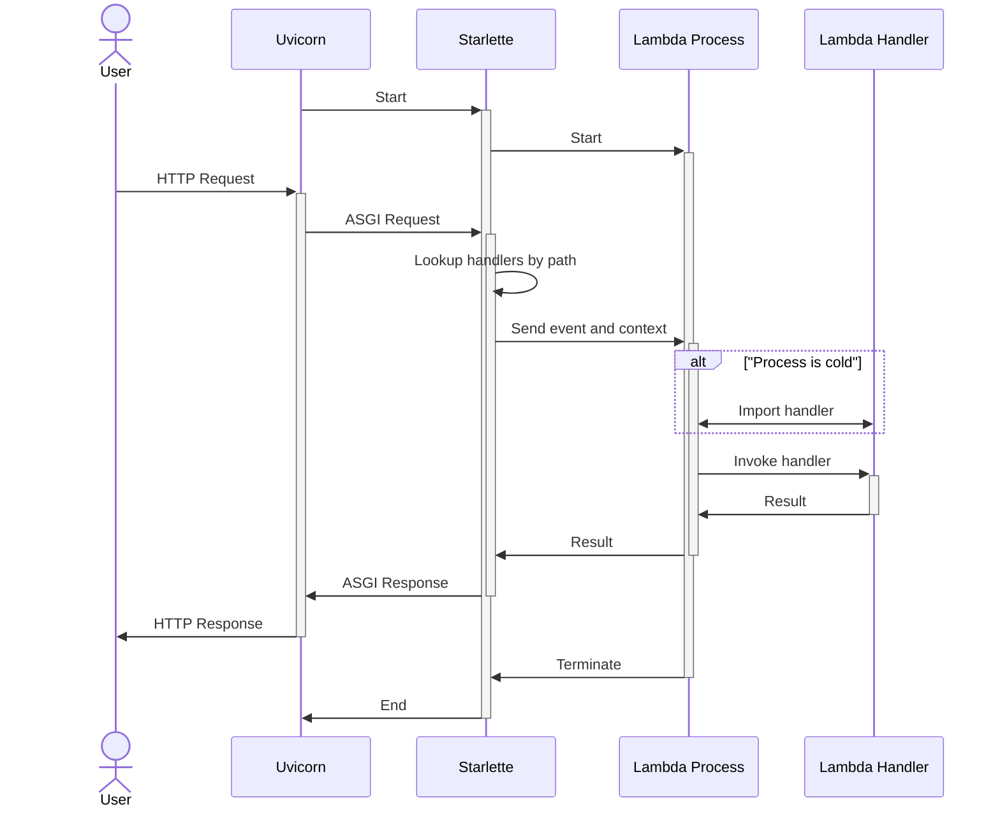

<p><svg width="995" height="300" viewBox="0 0 995 300" fill="none"
    xmlns="http://www.w3.org/2000/svg" class="main-logo">
<path fill-rule="evenodd" clip-rule="evenodd" d="M95.615 19.9197C112.399 7.00344 132.984 0 154.162 0H231C255.301 0 275 19.6995 275 44V176.456C275 194.769 266.496 212.044 251.982 223.213L179.385 279.08C162.601 291.997 142.016 299 120.838 299H44C19.6995 299 0 279.301 0 255V122.544C0 104.231 8.50423 86.9556 23.0178 75.7867L95.615 19.9197ZM137.757 74.8173C137.757 50.0654 157.822 30 182.574 30H197.512V89.7554H137.757V74.8173ZM78 89.7559H137.755L137.756 104.695C137.756 129.37 157.697 149.388 182.343 149.512L197.512 149.512V209.267H137.757V209.256L137.756 209.27V194.33C137.756 169.578 117.691 149.513 92.9389 149.513H77.9998L78.0373 149.511H78V89.7559ZM78 209.264H137.755V224.202C137.755 248.954 117.69 269.019 92.9381 269.019H78V209.264Z" fill="black"/>
<path d="M857.166 60.3281H826.928V199H857.166V144.687C857.166 137.497 859.028 132.04 862.751 128.316C866.475 124.464 871.097 122.538 876.619 122.538C887.661 122.538 893.182 128.894 893.182 141.605V199H923.42V137.946C923.42 124.336 920.21 114.064 913.79 107.13C907.499 100.068 898.832 96.5369 887.789 96.5369C881.369 96.5369 875.591 97.8851 870.455 100.582C865.319 103.15 860.89 106.745 857.166 111.367V60.3281Z" fill="black"/>
<path d="M792.991 68.0321V98.8481H817.259V120.997H792.991V168.184C792.991 171.266 793.633 173.513 794.917 174.925C796.329 176.209 798.705 176.851 802.043 176.851H817.259V199H793.761C784.003 199 776.363 197.074 770.842 193.222C765.449 189.37 762.753 182.051 762.753 171.266V120.997H745.997V100.773L707.788 206.319C704.065 216.591 699.314 224.359 693.536 229.624C687.758 234.888 679.669 237.52 669.268 237.52H644.23V213.638H660.794C665.801 213.638 669.268 212.803 671.194 211.134C673.249 209.593 675.046 206.319 676.587 201.311L676.78 200.926L639.03 98.8481H671.579L693.151 172.036L714.144 98.8481H762.753V68.0321H792.991Z" fill="black"/>
<path d="M422.232 201.311C407.337 201.311 395.781 198.551 387.564 193.03C379.346 187.508 374.852 178.52 374.082 166.066H402.972C403.614 171.715 405.604 175.696 408.942 178.007C412.409 180.19 417.288 181.281 423.58 181.281C428.331 181.281 432.183 180.446 435.136 178.777C438.089 177.108 439.566 174.797 439.566 171.844C439.566 169.661 439.052 167.927 438.025 166.643C436.998 165.359 434.943 164.204 431.862 163.177C428.78 162.149 423.965 161.058 417.417 159.902C402.009 157.206 391.223 153.354 385.06 148.346C378.897 143.339 375.815 136.534 375.815 127.931C375.815 118.044 379.795 110.34 387.756 104.819C395.717 99.2975 406.631 96.5369 420.498 96.5369C435.649 96.5369 447.013 99.6827 454.588 105.974C462.292 112.138 466.337 120.548 466.722 131.205H439.18C438.924 121.447 432.696 116.567 420.498 116.567C415.876 116.567 412.152 117.402 409.327 119.071C406.503 120.74 405.09 123.052 405.09 126.005C405.09 128.059 405.732 129.793 407.016 131.205C408.3 132.489 410.611 133.645 413.95 134.672C417.417 135.571 422.36 136.534 428.78 137.561C443.803 139.872 454.332 143.596 460.366 148.732C466.401 153.868 469.419 160.865 469.419 169.725C469.419 179.74 465.117 187.508 456.514 193.03C448.04 198.551 436.612 201.311 422.232 201.311Z" fill="black"/>
<path d="M602.957 141.605C602.957 135.827 601.801 131.205 599.49 127.738C597.179 124.271 593.455 122.538 588.319 122.538C582.926 122.538 578.625 124.464 575.415 128.316C572.205 132.04 570.6 137.497 570.6 144.687V199H540.362V141.605C540.362 135.827 539.142 131.205 536.702 127.738C534.391 124.271 530.667 122.538 525.531 122.538C520.139 122.538 515.837 124.464 512.627 128.316C509.417 132.04 507.812 137.497 507.812 144.687V199H477.574V98.8481H507.042V113.101C510.38 107.965 514.489 103.92 519.368 100.967C524.376 98.0135 530.154 96.5369 536.702 96.5369C543.251 96.5369 549.093 98.0777 554.229 101.159C559.365 104.241 563.345 108.799 566.17 114.834C570.022 109.313 574.773 104.883 580.422 101.545C586.2 98.2061 592.556 96.5369 599.49 96.5369C609.633 96.5369 617.787 100.068 623.95 107.13C630.113 114.192 633.195 124.464 633.195 137.946V199H602.957V141.605Z" fill="black"/>
</svg>
</p>

# Introduction

A versatile tool that enhances your AWS Lambda development experience.

## Installation

It's recommended to install Smyth into your project as a development dependency to use the same Python interpreter as your project:

=== "Poetry"
    ```bash
    poetry add --group dev smyth
    ```

=== "pip"
    ```bash
    pip install smyth
    ```

Define the following settings in your Lambda project's `pyproject.toml` file:

```toml
[tool.smyth]
host = "0.0.0.0"
port = 8080

[tool.smyth.handlers.saleor_handler]
handler_path = "my_project.handlers.saleor.handler.saleor_http_handler"
url_path = "/saleor/{path:path}"
```

!!! tip "See [configuration](user_guide/all_settings.md) for more settings and features."

Run Smyth with:

```bash
python -m smyth
```

!!! note "Also see"
    Make sure to check out the [links below](#others-from-mirumee) for more serverless-oriented tools.

## Features

- **Pure Python**: The tool is entirely written in Python, offering flexibility to tailor it to your specific requirements.
- **Customizability**: Modify both the `event` and `context` data structures to suit your needs.
- **State Persistence**: Simulates both cold and warm starts. Lambda processes retain their state across invocations, mimicking the behavior of actual AWS Lambdas. The state is reset only when code changes trigger Uvicorn to reload.
- **Efficiency**: Streamlined and efficient, relying solely on Python to execute the code.
- **Inspired by Serverless Framework**: Takes cues from the Serverless framework, known for its effectiveness in managing serverless applications.
- **Developer-Friendly**: Tailored for Python web developers, it integrates seamlessly with common development tools and practices such as PDB, iPDB, VSCode debugging, and .env file support, ensuring a familiar and productive environment.

## Rationale

Despite extensive testing, nothing matched the efficiency we experienced when developing ASGI (e.g., FastAPI) applications. Here is an overview of the alternatives we evaluated:

- **Serverless (with the serverless-offline plugin)**: This seemed promising, deploying a Node.js server to invoke the lambda in a subprocess, effectively simulating the AWS Lambda runtime through an AWS API Gateway V2 proxy. However, its maintenance is lacking; for instance, a pending pull request to add Python 3.12 as a supported runtime has been unresolved for nearly three months. Additionally, the development experience is hindered by the absence of Python Debugger support.

- **Localstack**: While Localstack offers useful features, its lambda functionality is less satisfactory. Testing code requires building and "uploading" the lambda to Localstack for invocation, a process that takes about a minute—far too slow for efficient local development.

- **AWS SAM**: Although newer and of higher quality than Serverless, AWS SAM offers fewer plugins and only supports pip for dependency management. While faster than Localstack, it still necessitates building the lambda for invocation.

- **Running the code locally**: We also explored using pytest to directly invoke lambda handlers. This approach is viable, but our specific needs require exposing lambdas over HTTP to interact with a remote (or local) instance of Saleor.

- **CDK**: A tool or framework that allows defining the Lambda stack in Python. It can spin up local Lambda invocations quickly and with many different events. However, it lacks the feature of HTTP exposure of the Lambda, which is critical when working with Saleor Apps.

- **Flask**: Flask could be used to invoke a handler from an endpoint. After a while of trying to make it work from a single entry point (i.e., one Docker container), we ended up with... well, this, but using a modern ASGI framework with Uvicorn as the HTTP server.

## How Smyth Works

Understanding the components involved in the Smyth environment is crucial for effective development. Here's a breakdown of the key terms:

- **Uvicorn**: An ASGI server responsible for translating incoming HTTP requests into Python callable formats that ASGI applications can understand. It serves as the interface between the web and your application, enabling asynchronous web server capabilities for Python.

- **Starlette**: A lightweight ASGI framework designed to catch and handle incoming requests. In the context of Smyth, Starlette facilitates communication with Lambda Processes, effectively acting as a bridge that routes requests to the appropriate handlers.

- **Lambda Process**: A dedicated Python process that runs a specific Lambda Handler. The primary purpose of maintaining separate processes for each Lambda Handler is to simulate the "warm" state of AWS Lambda functions, allowing them to retain their state between invocations. This setup mirrors the behavior of AWS Lambda in a local development environment.

- **Lambda Handler**: The core component of your Lambda function, written as part of your project. This is the code you craft to respond to Lambda invocations, typically defined as a Python function that accepts an `event` dictionary and a `context` object. The `event` contains information about the invocation, such as the triggering event or data passed to the function, while the `context` provides runtime information about the invocation, the function, and the execution environment.

Smyth operates similarly to Serverless (offline) but is implemented in pure Python with minimal dependencies. It utilizes a Starlette endpoint to provide a catch-all route. Uvicorn, in reload mode, runs Starlette, which automatically restarts the server and refreshes all Lambda processes. At startup, the Smyth Starlette application reads a TOML configuration file, initializing a process for each defined lambda handler. These processes import the handlers and start listening on a `multiprocessing.Queue`. When a request is received, Starlette's endpoint converts it into a Lambda event and places it in the queue. The subprocess then picks it up, invokes the handler, and returns the result to the main process via the queue, which then converts it back into an HTTP response.



## Others from Mirumee

- [Lynara](https://github.com/mirumee/lynara){target="_blank"} - Allows deploying ASGI (FastAPI, Django) applications on Lambda
- [Ariadne](https://ariadnegraphql.org/){target="_blank"} - Schema-first, Python GraphQL server
- [Ariadne Codegen](https://github.com/mirumee/ariadne-codegen){target="_blank"} - GraphQL Python code generator
